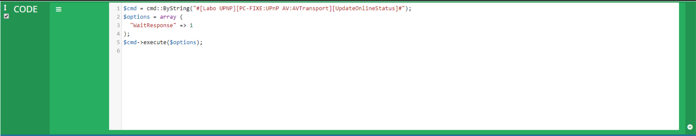
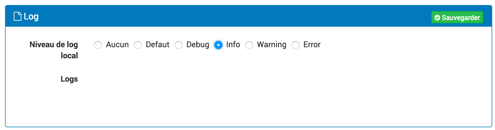
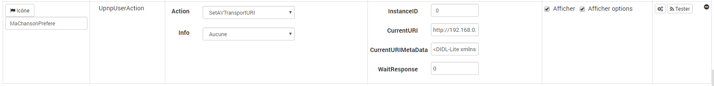
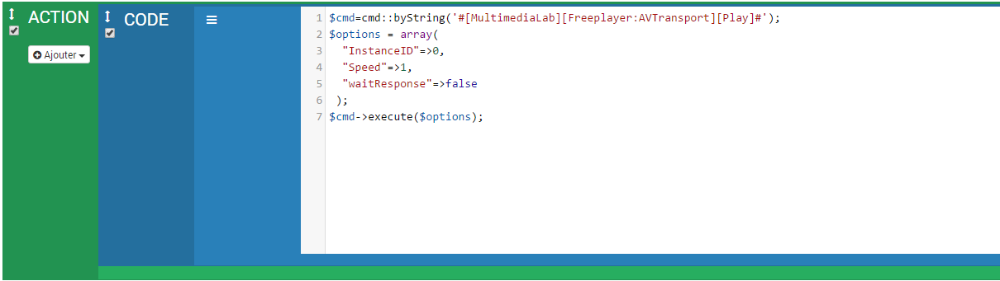
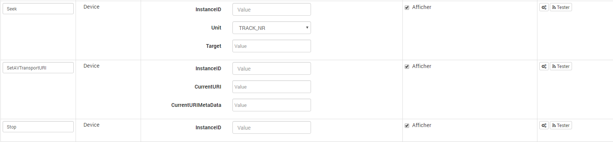

Description
===========

Ce plugin permet la gestion des périphériques Upnp.

Introduction
============

Chaque equipement généré par le plugin propose en plus des commandes Upnp
fourni par le service, deux commandes spécifique pour Jeedom :
- Une commande info "IsOnline" qui permet de savoir si un equipement est disponible ou non
- Une commande action "UpdateOnlineStatus" qui permet au besoin de controler si un equipement est bien en ligne ou non.

Principe de régulation
----------------------

> **Tip**
>
> Normalement, les equipement Upnp doivent se signaler 
> lorsqu’il se coupe, ce qui est géré par le plugin mais si par 
> exemple on coupe la prise d’un ecran de television, alors celui
> ci ne peut pas prévenir qu’il n’est plus disponible. Dans ce cas 
> le plugin ne se rendra alors compte que l’equipement n’est 
> ligne que lors du "heartbeat" qui se produit en général toutes
> les 30 minutes (c’est l’appareil qui defini cette valeur). La 
> commande "UpdateOnlineStatus" peut donc permettre de 
> résoudre ce problème. Suivant les appareils et ce qu’on 
> souhaite en faire, elle peut être executer via script toutes les 5 
> minutes par exemple pour controler l’état d’un périphérique 
> ou alors elle peut être utiliser dans un scénario pour 
> rafraichir l’etat de "IsOnline" afin de décider de l’action a faire 
> (par exemple éteindre ou allumer l’appareil) 

> **Tip**
>
> La commande UpdateOnlineStatus ne prend qu’un seul paramètre "WaitResponse". 
> Si WaitResponse = 1 alors commande est "bloquante" jusqu’a la réponse 
> de l’appareil, si celui ci est allumé, la réponse intervient en moins 
> d’une seconde mais si il est éteint, le temps d’attente de la réponse est 
> d’environ 5 secondes. Je préconise de n’utiliser le mode WaitResponse=1 
> que dans le cas d’un enchainement d’autre commande dans un scénario. 
> Dans le cadre du rafraichissement de la valeur de "IsOnline" toutes les 5 minutes 
> par exemple, il n’y a pas d’interet a metre WaitResponse=1 

Exemple d’utilisation de la commande dans un scénario:

Configuration du plugin
=======================

Une fois le plugin activé, les dépendances doivent s’installer automatiquement. 
Si ce n’est pas le cas ou si elles ne sont pas OK, cliquer sur relancer.
Ensuite il faut définir le port utilisé par le démon (si vous ne mettez rien, 
le port utilisé sera 5002).
Il est également possible de définir un objet parent par defaut 
(lors de leur création, les équipements sont directment associés a ce parent)
Enfin il est possible (en mode expert uniquement) de paramètrer le timeout des 
commandes (par défaut le timeout est de 10 secondes).

Log
---

Cette partie permet de choisir le niveau de log ainsi que d’en consulter
le contenu.

Sélectionner le niveau puis sauvegarder, le démon sera alors relancé
avec les instructions et traces sélectionnées.

Le niveau **Debug** ou **Info** peuvent être utiles pour comprendre
pourquoi le démon plante ou ne remonte pas une valeur.

> **Important**
>
> En mode **Debug** le démon est très verbeux, il est recommandé
> d’utiliser ce mode seulement si vous devez diagnostiquer un problème
> particulier. Il n’est pas recommandé de laisser tourner le démon en
> **Debug** en permanence, si on utilise une **SD-Card**. Une fois le
> debug terminé, il ne faut pas oublier de retourner sur un niveau moins
> élevé comme le niveau **Error** qui ne remonte que d’éventuelles
> erreurs.

Configuration des équipements
=============================

Recherche d’équipement
----------------------

Lors du démarrage du plugin, un scan des équipements upnp présent 
sur votre réseau est effectué.
Si le plugin est en mode inclusion (voir page de configuration des équipements) 
alors des équipements vont se créer, sinon seuls les équipements déjà présents
dans votre Jeedom seront opérationnels. Si vous souhaitez ajouter des équipements,
il faut que le plugin soit en mode inclusion (voir page de configuration des équipements)
et lancer une recherche (voir page de configuration des équipements). 
Bien sûr seuls les équipements allumés et présents sur votre réseau local 
pourront être détectés.
Une fois que les équipements requis ont été détectés, vous pouvez quitter 
le mode inclusion et supprimer ceux que vous considérez comme inutiles.
 
> **Tip**
>
> Si vous supprimez des équipements mais que vous restez en mode inclusion, 
> ceux-ci risquent de se recréer même sans faire de recherche. 

Paramétrage des Équipements
---------------------------

Pour les services disposant d’un widget spécifiques :
ContentDirectory
AVTransport
Il est possible de choisir entre l’affichage "standard" des commandes et 
l’affichage spécifique aux services. En complément de l’affichage spécifique, 
il est possible d’afficher les commandes du service "non gérées" par l’affichage 
spécifique et de forcer l’affichage des commandes en "standard" en plus 
de l’affichage spécifique.
 
> **Tip**
>
> Que se soit pour les services disposant d’un widget spécifique ou pour les autres 
> services, l’affichage en mode "standard" prend en compte les paramétrages 
> des commandes (affichage On/Off). 

Paramétrage des Commandes
-------------------------

Les actions mises à disposition par le plugin nécessitent la plupart 
du temps des paramètres. Il est possible via l’onglet "Commandes" de 
la page de configuration d’un équipement de définir des valeurs par 
défaut pour ces paramètres et de créer plusieurs configurations de la 
même commande, ceci permet par exemple de créer les actions On et Off 
pour la commande UPnP "SetBinaryState" ou encore de créer un bouton permettant 
de charger sa chanson préférée ou même de paramétrer plusieurs radios. 
Pour cela il faut créer une nouvelle commande d’action et dans le champ "Action" 
correspondant à la commande créée, de définir l’action UPnP que l’on souhaite 
paramétrer. Ensuite, après enregistrement, les paramètres de la commande 
apparaissent dans le champ "Option" de la commande.

> **Tip**
>
> Si vous n’avez pas besoin d’afficher les paramètres des commandes 
> sur le dashboard (parce que, par exemple, la valeur par défaut que 
> vous avez indiquée est la seule qui vous intéresse alors vous pouvez 
> décocher la checkbox "Afficher les options"). 

> **Tip**
>
> La valeur du champ "Information" peut être renseigné afin de définir 
> quelle information est en relation avec cette action (à part pour la 
> commande SetBinaryState, je ne vois pas de cas d’usage mais sait-on 
> jamais, soyez inventif). 

> **Tip**
>
> L’option WaitResponse est utilisée si vous souhaitez "enchainer" 
> des commandes dans un scénario par exemple, le traitement ne passera
> à la commande suivante que lorsque la commande avec WaitResponse = 1 
> ou true sera finie. Si WaitResponse = 0 ou false, alors la commande 
> suivante sera exécutée sans attendre la fin de la première commande. 
> Dans la plupart des cas, mettre 0 ou 1 ou rien n’a pas d’incidence. 

FAQ
===
.Comment faire un appel aux commandes des équipements Upnp dans les scénarios ?
Les commandes Upnp nécessitent des paramètres pour être exécutées, il est nécessaire de passer par un bloc code. 
Exemple :

Pour connaitre les paramètres de chaque commande, il faut regarder le paramétrage des commandes sur l’équipement 
(attention pour les listes de valeur, il faut saisir une valeur autorisée).

Troubleshoting
==============
.Dans le log il y a parfois des messages : "Unable to find the service with SID XXX".
Ces messages n’ont pas d’incidence en fonctionnement normal et sont là uniquement 
pour du dépannage. Ce genre de message apparaît notamment lorsque l’on redémarre 
le service et sont liés à de précédents abonnements aux messages des services UPnP.

.Lorsque j’exécute certaines commandes, j’ai un message d’erreur indiquant que la commande n’a pas pu s’exécuter dans le délai imparti..
La configuration du plugin permet de définir le timeout de l’exécution d’une 
commande (voir la rubrique configuration). Dans mon cas, lors du chargement 
d’un média sur ma télévision, la première fois, le délai de réponse de la télévision 
a pu dépasser les 5 secondes. Si ce problème vous arrive, il suffit de relancer l’action. 
Si ce problème arrive régulièrement, augmentez le délai du timeout.
 
> **Tip**
>
> La valeur par défaut est 10 secondes. 

